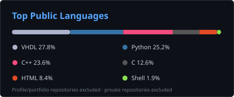

# Mehdi Bouama

**M2 E3A · SETI · Université Paris-Saclay**

FPGA · SoC · Embedded Systems · Digital Design

**Seeking a 2027 internship in FPGA/SoC and embedded systems**

---

## About

- 🎓 M2 E3A — SETI at Université Paris-Saclay
- 🔧 FPGA and digital design: VHDL, GHDL, Quartus, FSM and datapath architectures
- 💻 Embedded systems: C, C++, ESP32, Raspberry Pi and Linux
- 🤖 Robotics and sensing: LiDAR, sonar, control systems and sensor integration

---

## Selected Projects

| Project | Focus | Highlights |
|---|---|---|
| [8-bit Multicycle Processor](https://github.com/mahdidou711/vhdl-8bit-multicycle-processor) | FPGA · Processor architecture | 8-bit multicycle processor · 12-operation ALU · exhaustive verification · Terasic DE1 · CI |
| [Integer Square Root Core](https://github.com/mahdidou711/vhdl-integer-sqrt) | FPGA · Arithmetic architecture | 16-bit integer square root · 65,536 inputs verified · Terasic DE1 · CI |
| [Sequential VHDL Search & Multiplier](https://github.com/mahdidou711/vhdl-search-multiplier) | FPGA · Digital design | Sequential search FSM · iterative 8×8 multiplier · exhaustive verification · Terasic DE1 · CI |
| [CoVAPSy](https://github.com/mahdidou711/mahdidou711-covapsy) | Autonomous robotics | Raspberry Pi 4 · RPLidar A2M12 · SRF10 sonar · 50 Hz control loop |
| [C Image Processing SIMD](https://github.com/mahdidou711/c-image-processing-simd) | Low-level optimization | C · OpenMP · SIMD-oriented image processing |
| [RPN Calculator](https://github.com/mahdidou711/RPNcalculator) | Low-level C | C99 · CMake · stack-based evaluation · shunting-yard parser · CI |

---

## Technical Stack

**FPGA & Digital Design**

VHDL · FPGA · GHDL · Quartus · FSM · Datapath Design

**Embedded Systems**

C · C++ · STM32 · ESP32 · Raspberry Pi · Linux

**Software & Tooling**

Python · Git · GitHub Actions · CMake · LaTeX

**Robotics & Sensing**

LiDAR · Sonar · Control Systems · Sensor Integration

---

## Public Repository Languages

