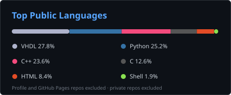

# Mehdi Bouama

**M2 E3A · SETI · Université Paris-Saclay**

FPGA · RTL · Digital Design · Processor Architecture · Embedded Systems

**Seeking a 4–6 month final-year internship from March 18, 2027 in FPGA/RTL, digital design, processor architecture, SoC integration or hardware/software co-design**

---

## About

- 🎓 M2 E3A — SETI at Université Paris-Saclay
- 🔧 FPGA / RTL / Digital Design: VHDL, GHDL, Intel Quartus Prime, FSM and datapath design, processor architecture and exhaustive RTL verification
- 💻 Embedded Systems / HW-SW Integration: C, C++, Linux, Raspberry Pi, STM32, ESP32, sensors and robotics
- 🎯 Interested in SoC design/integration, processor architectures and hardware/software co-design

---

## Selected Projects

| Project | Focus | Highlights |
|---|---|---|
| [8-bit Multicycle Processor](https://github.com/mahdidou711/vhdl-8bit-multicycle-processor) | FPGA · Processor architecture | 8-bit multicycle processor · 12-operation ALU · 1.57M+ GHDL test vectors · DE1 hardware implementation · CI |
| [Integer Square Root Core](https://github.com/mahdidou711/vhdl-integer-sqrt) | FPGA · Arithmetic architecture | 16-bit integer square root · 65,536 inputs verified · DE1 hardware implementation · CI |
| [Sequential VHDL Search & Multiplier](https://github.com/mahdidou711/vhdl-search-multiplier) | FPGA · Digital design | Sequential search FSM · iterative 8×8 multiplier · exhaustive GHDL verification · DE1 hardware implementation · CI |
| [CoVAPSy](https://github.com/mahdidou711/mahdidou711-covapsy) | Autonomous robotics | Raspberry Pi 4 · RPLidar A2M12 · SRF10 sonar · 50 Hz control loop |
| [C Image Processing SIMD](https://github.com/mahdidou711/c-image-processing-simd) | Low-level optimization | C · OpenMP · SIMD-oriented image processing |
| [RPN Calculator](https://github.com/mahdidou711/RPNcalculator) | Low-level C | C99 · CMake · stack-based evaluation · shunting-yard parser · CI |

---

## Technical Stack

**FPGA & Digital Design**

VHDL · FPGA · RTL Design · RTL Verification · GHDL · Intel Quartus Prime · FSM · Datapath Design · Processor Architecture

**Embedded Systems**

C · C++ · STM32 · ESP32 · Raspberry Pi · Linux · Hardware-Software Integration

**Software & Tooling**

Python · Git · GitHub Actions · CMake · LaTeX

**Robotics & Sensing**

LiDAR · Sonar · Control Systems · Sensor Integration

---

## Public Repository Languages

